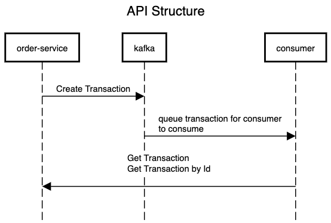

# producer

[](https://dl.circleci.com/status-badge/redirect/gh/Isaacwhyuenac/effective-potato/tree/main)

The repo consists of

- [order-service](order-service) a RESTful API with kafka producer.
- [consumer](consumer) a consumer that consumes the transaction data to the database

[]

The layout of each repo follows a standard standup

├── Application.java
├── config -> configuration class
├── constants
├── controller -> REST controller
├── domain -> Database Entity class
├── dto -> pojos that deal with receiving and sending data
├── mq -> logic related to sending data to MQ (Kafka)
├── repository -> data querying class
├── service -> class with @Service annotation
└── utils -> Common functionalities

## Requirement

### API modeling (Swagger/OpenAPI)

OpenAPI is used to build up the API specification. When you build the [order-service](order-service), the swagger json document will appear in the `/docs/swagger.json`. You can copy the json and view it in the browser.

```zsh
./gradlew clean generateOpenApiDocs
```

### Security (authentication and authorization)

Auth0 service is chosen to provide the sample authentication and authorization setup. An API caller is supposed to request an Authorization token in order to reach our APIs.

### Data access

Spring JPA is used to map the database object into java Entity objects. Modelmapper is used to transform the Entity Class Object into Data Transfer Object.

### Logging and monitoring

Logging are added to critical part of the application for better tracing any defects.

### Testing

Unit tests, Integration tests and Contract tests are created to verify the functionality of our APIs.

For contract test, [consumer/src/test/java/com/example/consumer/BaseClass.java](consumer/src/test/java/com/example/consumer/BaseClass.java) and [producer/ConsumerConsumerTest](order-service/src/test/java/com/example/producer/ConsumerConsumerTest.java) serve a good example.

## Development Environment Setup

You will need the docker to setup the environment.

```zsh
docker-compose up -d
```

## Build Image

```zsh
./gradlew build
docker-compose build && docker-compose push
```


